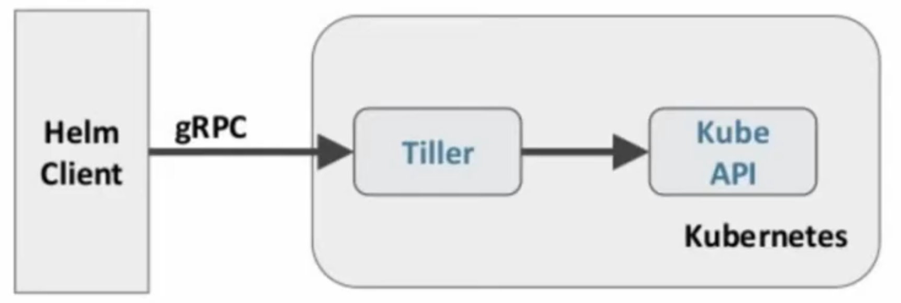

# About HELM 

## 什么是HELM
HELM是官方提供的类似于 YUM 的包管理器，是部署环境的流程封装。HELM有两个重要的概含: chart 和release:

* chart 是创建一个应用的信息集合， 包括各种 Kubernetes 对象的配置模板、 参数定义、 依赖关系、 文档说明等。chart 是应用部署的自包含逻辑单元。可以将chat想象成apt, yum中的软件安装包
* release是chart的运行实例，代表了一个正在运行的应用。当chart被安装到kubernetes集群，就生成一个release。chart能够多次安装到同一个集群，每次安装都是一个release

## HELM 包含两个组件： HELM客户端和Tiller服务器:
 

## Install HELM
```bash
$ wget https://get.helm.sh/helm-v3.4.1-linux-amd64.tar.gz
$ tar vxzf helm-v3.4.1-linux-amd64.tar.gz
$ sudo mv linux-amd64/helm /usr/local/bin/helm
$ helm version
# clean up
$ rm helm-v3.4.1-linux-amd64.tar.gz
$ rm -rf linux-amd64
```

### Initalize chart repo
```
# add and update repo
$ helm repo add "stable" "https://charts.helm.sh/stable" --force-update
```

### Search chart
```
$ helm search hub kafka
```

### Install a package
```
$ helm install happy-panda stable/mariadb
```
happy-panda is the release name


## Build HEML Template
* 创建文件夹
    ```
    $ mkdir ./hello-world
    $ cd ./hello-world
    ```

* 创建自描述文件Chart.yaml，这个文件必须有name和version定义
    ```
    $ cat << 'EOF' > -/Chart.yaml
    name: hello-world
    version: 1.0.0
    EOF
    ```

* 创建模板文件，用于生成 Kubernetes 资源清单(manifests)
    ```bash
    $ mkdir ./templates # folder name has to be templates
    $ cat << 'EOF' > ./templates/deployment.yaml
    apiVersion: extensions/v1beta1
    kind: Deployment
    metadata:
      name: hello-world
    spec:
      replicas: 1
      template:
        metadata:
          labels:
            app: hello-world
        spec:
          containers:
            - name: hello-world
              image: hub.atguigu.com/library/myapp:v1
              ports:
                - containerPort: 8089
                protocol: TCP
    EOF
    $ cat <<'EOF' > .itemplates/service.yaml
    apiVersion: v1
      kind: Service
      metadata:
        name: hello-world
      spec:
        type: NodePort
        ports:
        - port: 8989
          targetPort: 8980
          protocol: TCP
        selector:
          app: hello-world
    EOF
    ```
    * To install your template
    ```
    $ helm install .
    ```

# Some HELM Commands
* list deployed releases
    ```
    $ helm ls
    ```