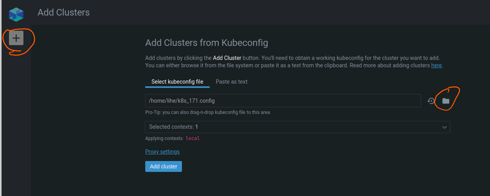

# Create K8S cluster using RKE

## Environments:

|   | OS | RAM | Disk | IP |
|---|---|---|---|---|
| Client | WSL: Kali-linux | n/a | n/a | n/a |
| Master | Ubuntu 20.04 | 4G | 64G | 192.168.1.171 |
| Worker-1 | Ubuntu 20.04 | 4G | 64G | 192.168.1.172 |
| Worker-2 | Ubuntu 20.04 | 4G | 64G | 192.168.1.173 |

## Install docker on Master, Worker-1, Worker-2
```bash
sudo apt update && sudo apt upgrade -y
curl https://releases.rancher.com/install-docker/19.03.sh | sh
sudo apt update && sudo apt upgrade -y
sudo reboot
```

## **The following steps should be taken on the Client machine**
## Install RKE
```bash
wget https://github.com/rancher/rke/releases/download/v1.0.14/rke_linux-amd64
mv rke_linux-amd64 rke
chmod a+x rke
sudo mv rke /usr/local/bin
rke --version
```

## Prepare ssh id, I give no passphrase to make it easy
```bash
ssh-keygen
# copy to all nodes
ssh-copy-id lihe@192.168.1.171
ssh-copy-id lihe@192.168.1.172
ssh-copy-id lihe@192.168.1.173
```

## Prepare cluster.yml
```bash
# prepare working folder, we put all our files there
mkdir ~/k8rke
cd ~/k8rke
cat << EOF > cluster.yml
nodes:
    - address: 192.168.1.171
      user: lihe
      role:
        - controlplane
        - etcd
        - worker
    - address: 192.168.1.172
      user: lihe
      role:
        - worker
    - address: 192.168.1.173
      user: lihe
      role:
        - worker
EOF
```

## Create k8s cluster using rke
```bash
rke up
```
**Long time wait.**
### Known Issue:
```
FATA[0722] Failed to get job complete status for job rke-network-plugin-deploy-job in namespace kube-system
```
**Solution**

run `rke up` again:
```bash
rke up
```

## Install kubectl
```
curl -LO "https://storage.googleapis.com/kubernetes-release/release/$(curl -s https://storage.googleapis.com/kubernetes-release/release/stable.txt)/bin/linux/amd64/kubectl"
chmod a+x kubectl
sudo mv kubectl /usr/local/bin
kubectl version --client
```

## Prepare config file for kubectl 
when create cluster via `rke up`, a file named `kube_config_cluster.yml` is created under `~/k8rke`. That is the config file for kubectl connect to the cluster.
```
mkdir ~/.kube
cp ~/k8rke/kube_config_cluster.yml ~/.kube/config
```

## Verify connection
```
kubectl cluster-info
```
Should see something like the following:
```
Kubernetes master is running at https://192.168.1.171:6443
CoreDNS is running at https://192.168.1.171:6443/api/v1/namespaces/kube-system/services/kube-dns:dns/proxy

To further debug and diagnose cluster problems, use 'kubectl cluster-info dump'.
```

## Connect cluster using LENS
* Install LENS: https://k8slens.dev/
* Add cluster: **use the same config file for kubectl**

* Turn on `Metrics Stack`(Prometheus) on LENS:
  * right click the cluster icon, then `settings`

