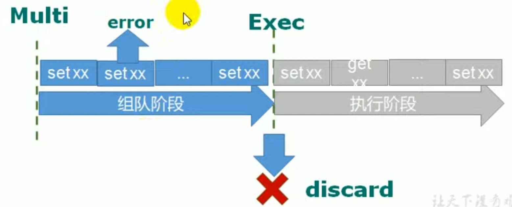

# Transactions

MULTI, EXEC, DISCARD and WATCH are the foundation of transactions in Redis. They allow the execution of a group of commands in a single step, with two important guarantees:
* All the commands in a transaction are serialized and executed sequentially.
* Either all of the commands or none are processed(processed does not mean success) , so a Redis transaction is also atomic. 
* **Errors inside a transaction does not rollback**.

## Related commands
* DISCARD
* EXEC
* MULTI
* UNWATCH
* WATCH

## No roll back

## Redis的事务定义

* Redis的事务是一个单独的隔离操作，事务中所有命令都会序列化，按顺序执行。在执行事务的过程中，不会被其他客户端发送过来的命令请求所打断
* Redis事务的主要作用就是串联多个命令防止插队

## Multi, Exec, Discard
* 从输入Multi命令开始，输入的命令都会依次进入队列中，但不会执行，知道输入Exec后，Redis会依次执行队列中的命令
* 组队的过程中可以通过Discard来放弃组队

## 事务的错误处理
* 组队中某个命令出现了错误，执行时整个队列都会被取消。

* 如果执行阶段某个命令报出错误，则只有报错命令不会被执行，其他命令都会执行，不会回滚。
