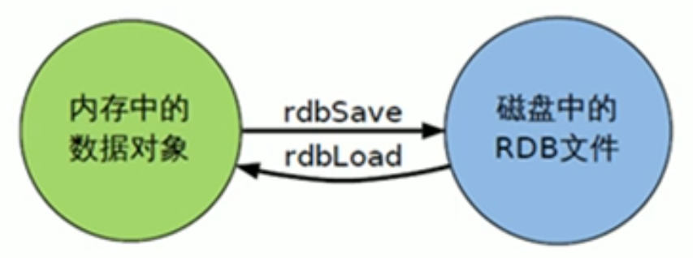

# Redis Persistence - RDB

## Redis Persistence
* RDB (Redis DataBase)
* AOF (Append Of File)

## RDB

* 在指定的时间间隔内将内存中的数据集快照(Snapshot)写入磁盘, 恢复时将快照直接读到内存里。

### 备份是如何执行的

* Redis会单独创建 (fork) 一个子进程来进行持久化， 会先将数据写入到一个临时文件中， 待持久化过程都结束了， 再用这个临时文件替换上次持久化好的文件。 整个过程中， 主进程是不进行任何操作的。 这就确保了极高的性能。如栗需要进行大规模的数据恢复， 但对于数据恢复的完整性不是非常敏感， 那RDB方式要比APF方式更加的高效。 RDB的缺点是最后一次持久化后的数据可能丢失。

### 关于fork

* 在Linux程序中`fork`会产生一个和父进程完全相同的子进程。 但子进程在此后多会执行系统调用， 出于效率考虑， Linux中引入了 "写时复制" (copy on write)技术， 一股倩况父进程和子迸程会共用同一段物理内存， 只有进程空间的各段的内容耍发生变化时， 才会将父进程的内容复制一份给子进程 。

### RDB的保存文件(path and file name)
* redis.conf
```
dbfilename dump.rdb
...
dir ./
...
```

### RDB Persistence policy
* Interval and Changes
```
# Save the DB on disk:
#
#   save <seconds> <changes>
#
#   Will save the DB if both the given number of seconds and the given
#   number of write operations against the DB occurred.
#
#   In the example below the behavior will be to save:
#   after 900 sec (15 min) if at least 1 key changed
#   after 300 sec (5 min) if at least 10 keys changed
#   after 60 sec if at least 10000 keys changed
#
#   Note: you can disable saving completely by commenting out all "save" lines.
#
#   It is also possible to remove all the previously configured save
#   points by adding a save directive with a single empty string argument
#   like in the following example:
#
#   save ""

save 900 1
save 300 10
save 60 10000
```

* Manaul persist snapshot using command
    * `save` -  blocking
    * `bgsave` - nonblocking, background

* `stop-writes-on-bgsave-error yes`： 当redis无法写入磁盘话，直接关掉redis的写操作

* `rdbcompression yes`: 文件压缩

* `rdbchecksum yes`: 使用CRC64算法进行数据校验， 但是这样做会增加大约10%的性能消耗， 如果希望获取到最大的性能， 可以关闭此功能。


### RDB backup
* 先通过`config get dir`命令查询rdb文件的目录
* 将`*.rdb`的文件拷贝到别的地方

### RDB recovery
* Shutdown Redis
* copy backup file to redis working folder
* start redis, data will be loaded 



### RDB 的优点
* 节省磁盘空间
* 恢复快速

### RDB 的缺点
* 虽然Redis在`fork`时使用了写时拷贝技术，但是如果数据量庞大时，还是比较消耗性能。
* 如果在备份周期中间redis down机，可能丢失数据
