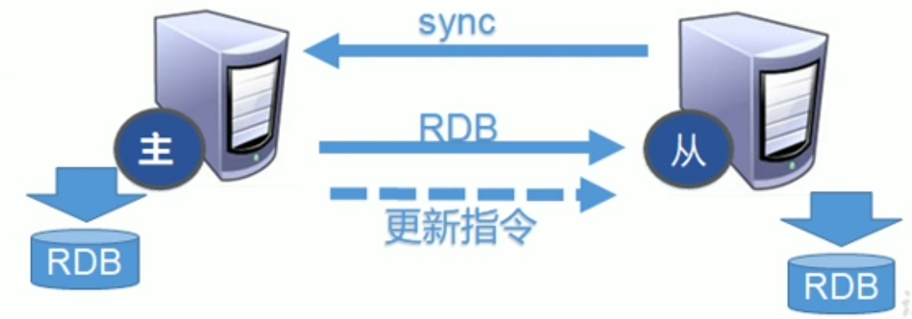

# Redis Replication

## What is replication

* 主从复制，就是主机数据更新后根据配置和策略，自动同步到备机的master/slave机制。Master以写为主，Slave以读为主。

## 用处

* 读写分离，性能扩展

* 容灾快速恢复


## Commands
* `info replication`

    show replication information

* `replicaof <ip> <port>`

    成为某个实例的从服务器

## Config: `replica-read-only`
    if `yes`, write via slave is not allowed, this will protect slave from untrusted write. This is recommended.


## 复制原理

* 每从机联通后′，都会给主机发送Sync命令

* 主机立刻进行存盘操作，发送RDB文件给从机

* 从机收到RDB文件后，进行全盘加载

* 之后每次主机的写操作，都会立刻发送给从机，从机执行相同的命令



## Chained Replica

* 上一个Slave可以是下一个Slave的Master。Slave同祥可以接收其他Slaves的连接和同步请求，那么该Slave作为链条中下一个的master， 可以有效减轻Master的压力，去中心化降低风险。

* 用`replicaof <ip> <port>`

* 中途变更转向，会清除数据，重新建立拷贝最新的。

* 风险是中间一个Slave down机，后续Slave无法拷贝


## Some points
* any slave down and start again, it by default become a standalone master. Need re-run `replicaof` to join the replication again.
* master down, none of slave will promote to master. When master back the relation remain.

## Manual change slave to master(反客为主)
* 当一个master宕机后，后面的slave可以立刻升级为master,其后面的slave不用做任何修改。
* 用`replicaof no one`将从机变为主机。


## Sentinel(哨兵模式)
* 反客为主的自动版，能够后台监控主机是否故障，如果主机故障，根据投票数将从机变为主机。


### 配置哨兵
* 1 master, 2 slaves, not chained.
* create conf/sentinel.conf
```
sentinel monitor mymaster 127.0.0.1 6379 1
```
其中mymaster为监控对象起的服务器名称, 1位至少有多少个哨兵同意迁移的数量。

### 启动哨兵
```
redis-sentinel conf/sentinel.conf
```

### Slave promote rule:
* 优先级靠前的
    * redis.conf中`replica-priority`值, less (not 0) = higer priority
    * 0 means never promote 
* 偏移量大的(数据最新)
* 服务runid (a generated guid for service instance)最小的


