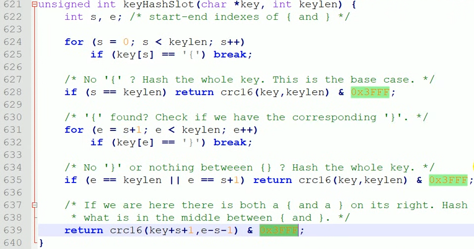
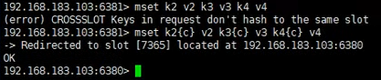

# Redis Cluster

## 什么是集群
* Redis集群实现了对Redis的水平扩容，即启动N个Redis节点，将整个数据库分布存储在这N个节点中，每个节点存储总数据的1/N。

* Redis集群通过分区(partition)来提供一定程度的可用性(availablity):即使集群中有一部分节点失效或者无法进行通讯，集群也可以继续处理命令请求。

* 通过 `cluster nodes` 命令查看集群信息

* 每个节点，可以有Replicaiton, 并有内置的哨兵机制(自动failover)

* 一个集群至少3个主节点。 每个主节点至少一个replication

* 分配原则尽量保证每个主数据库行在不同的IP地址，每个从库和主库不在一个IP地址上。

## 什么是slots

* 一个 Redis 集群包含 16384 个插槽 (hash slot)， 数据库中的每个键值都属于这16384个插槽的其中一个， 集群使用公式 `CRC16(key) % 16384` 来计算键 `key` 属于那个插槽，′ 其中 `CRC16(key)`语句用于计算键 `key`的`CRC16`校验和 。

* 集群中的每个节点负责处理一部分插槽。 举个例子，如果一个集群可以有3个主节点′ 其中:
    * 节点A负责处理0号至 5500号插槽。
    * 节点 B 负责处理 5501 号至 11000 号插槽。
    * 节点C负责处理 11001 号至16383号插槽。

## Hash Source Code

## 在集群中set/insert值
* 在redis-cli每次录入，查询键值，redis都会计算出该key应该送往的插漕, 如果不是该客户端对应的服务器插槽，redis会报错并告知应前往的redis实例地址和端口。

* redis-cli提供了 `-c` 参数实现自动重定向。     
    * 例如 `redis-cli -c -p6379` 登入后, 再录入、 查询键值可以自动重定向。

* 不在一个solt下的键值，是不能使用mget, mset等多键操作的

* 可以通过{}来定义组的概念，从而是key中{}内相同内容的键值对应到同一个slot中去。

## 查询集群中的值

* `CLUSTER KEYSLOT <key>` 计算键 key 应该被放置在那个槽上。

* `CLUSTER COUNTKEYSINSLOT <slot>` 返回槽slot目前包含的键值对的数量。

* `CLUSTER GETKEYINSLOT <slot> <count>` 返回count个slot槽中的键

## Configuration

* **cluster-require-full-coverage <yes/no>** : If this is set to yes, as it is by default, the cluster stops accepting writes if some percentage of the key space is not covered by any node. If the option is set to no, the cluster will still serve queries even if only requests about a subset of keys can be processed.